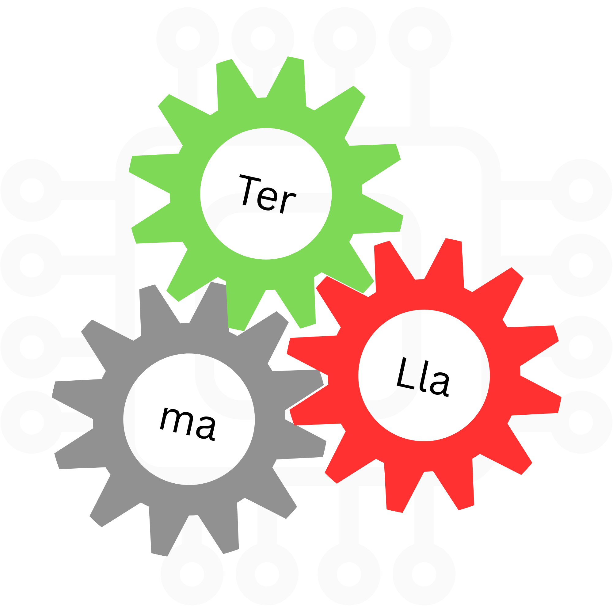

# Terllama

<p align="center">
  
</p>

**Alpha**: under active development. Kernels work. Output is plausible. Expect rough edges.

Ternary LLM inference engine. CPU-first, multi-ISA (scalar, AVX2, NEON).  
Runs SmolLM2-135M (and similar ternary-quantized models) using I2_S packed weights, INT8 activations, and tile-parallel tiling.

Features an OpenAI-compatible API server, web chat UI, and model management CLI, similar to Ollama.

Discord: https://discord.com/invite/TBB6KNkP7M

## Quick Start

```bash
# 1. Build
make

# 2. Pull a model from HuggingFace
./terllama pull HuggingFaceTB/SmolLM2-135M --format i2s

# 3. Start the API server
./terllama serve --port 8375

# 4. Open http://localhost:8375 in your browser
#    Or use curl:
curl http://localhost:8375/v1/models
curl -X POST http://localhost:8375/v1/chat/completions \
  -H "Content-Type: application/json" \
  -d '{"messages":[{"role":"user","content":"Hello!"}],"stream":false}'
```

## Build

```bash
make          # terllama + terllama-bench
make terllama # main binary only
make bench    # benchmark only
```

Detects available ISA extensions (AVX2+FMA, NEON) and compiles matching kernels. Missing ISAs are skipped. On x86_64 without AVX2 the scalar fallback is used.

**Dependencies:** C++17 compiler, OpenMP, make. No external libraries needed (cpp-httplib included in `third_party/`). Tokenizer uses Python 3 (transformers).

## CLI Usage

```bash
# Run inference directly
./terllama "What is the capital of France?" 100 0.7

# List installed models
./terllama list

# Show model details
./terllama show SmolLM2-135M

# Download a model from HuggingFace
./terllama pull HuggingFaceTB/SmolLM2-135M --format i2s

# Remove a model
./terllama rm SmolLM2-135M

# Start API server (OpenAI-compatible)
./terllama serve --port 8375

# Interactive CLI chat
./terllama chat --model SmolLM2-135M --prompt "Hello!"

# Interactive mode (no --prompt = multi-turn)
./terllama chat --model SmolLM2-135M
```

## API Server

The server exposes an OpenAI-compatible API at `http://localhost:8375`:

| Endpoint | Method | Description |
|----------|--------|-------------|
| `/v1/models` | GET | List available models |
| `/v1/chat/completions` | POST | Chat completions (streaming + non-streaming) |
| `/v1/completions` | POST | Text completions |
| `/health` | GET | Health check |
| `/` | GET | Web UI |

### Chat Completions

```bash
curl -X POST http://localhost:8375/v1/chat/completions \
  -H "Content-Type: application/json" \
  -d '{
    "model": "default",
    "messages": [
      {"role": "system", "content": "You are a helpful assistant."},
      {"role": "user", "content": "Hello!"}
    ],
    "temperature": 0.7,
    "max_tokens": 256,
    "stream": true
  }'
```

For streaming, set `"stream": true`. The server sends SSE events (`data: {...}\n\n`) and terminates with `data: [DONE]\n\n`.

### Environment Variables

| Variable | Default | Description |
|----------|---------|-------------|
| `TERLLAMA_MODEL_DIR` | `.` | Model file directory |
| `TERLLAMA_PORT` | `8375` | Server port |
| `TERLLAMA_ARCH` | auto | Force CPU arch (scalar, avx2, neon, etc.) |

## Web UI

A single-file HTML chat interface at `http://localhost:8375/` (served by the API server). Features:

- Chat interface with streaming responses
- Model selection dropdown
- System prompt input (collapsible)
- Temperature slider
- Conversation history
- Copy response button
- Clear chat button
- Dark/light mode (auto-detect + toggle)
- Responsive (works on mobile)

No build tools or npm needed. The C++ server serves it directly.

## Model Management

Models are stored in `~/.terllama/models/<repo-name>/` and tracked in `~/.terllama/models.json`.

```bash
# Download from HuggingFace
./terllama pull HuggingFaceTB/SmolLM2-135M --format i2s

# List installed
./terllama list

# Show model architecture
./terllama show SmolLM2-135M

# Remove
./terllama rm SmolLM2-135M
```

## Docker

```bash
docker build -t terllama .
docker run -p 8375:8375 -v ~/.terllama:/root/.terllama terllama
```

## Results (SmolLM2-135M)

### Model Size

| Format | Size | Notes |
|--------|------|-------|
| FP32 original | ~540 MB | 135M params × 4 bytes |
| I2_S .gguf (BitNet) | 1.2 GB | BitNet-b1.58-2B-4T reference |
| Decomposed I2S binary | **139 MB** | Terllama format, ~4× smaller than FP32 |

### PPL on WikiText-2

| Method | PPL | Ratio vs FP32 |
|--------|-----|---------------|
| FP32 baseline | 15.89 | 1.0× |
| Terllama (8-term FFN / 10-term QKV / 12-term O / 15-term LM) | 16.84 | 1.06× |
| Terllama (10+ terms all layers) | 16.23 | 1.02× |

### Per-Layer Decomposition Accuracy (8 ALS terms)

| Layer | Shape | Rel Error | Cos Sim | Best Method |
|-------|-------|-----------|---------|-------------|
| Attention Q | 576×576 | 7.93% | 0.997 | ALS |
| Attention K | 576×576 | 7.03% | 0.998 | ALS |
| Attention V | 576×576 | 5.08% | 0.999 | ALS |
| Attention O | 576×576 | 11.36% | 0.994 | ALS |
| FFN Gate | 1536×576 | 4.92% | 0.999 | ALS |
| FFN Up | 1536×576 | 3.78% | 0.999 | ALS |
| FFN Down | 576×1536 | 7.41% | 0.997 | ALS |
| LM Head | 49152×576 | 13.43% | 0.996 | ALS |

Accuracy improves with more terms: at 10 terms the FFN layers drop below 2% error; at 12 terms the attention projections reach <5%.

### Compared: TinyLlama-1.1B

| Method | PPL | Ratio |
|--------|-----|-------|
| FP32 baseline | 8.24 | 1.0× |
| Terllama (12 terms all layers) | 8.26 | **1.003×** |

Larger models decompose with less loss. 1.1B is nearly lossless at 12 terms.

## Architecture

| Layer | File | Role |
|-------|------|------|
| Dispatcher | `src/dispatcher.cpp` | Runtime CPU detection, selects optimal kernel |
| Kernels | `src/kernel_avx2.cpp`, `src/kernel_neon.cpp` | ISA-specific ternary matmul |
| Model | `src/model.h` | Binary format, layer layout |
| Loader | `src/loader.h` | I2_S + ALS format loader |
| Inference | `src/inference.h` | Autoregressive generation loop |
| CLI | `src/main.cpp` | CLI entry point + subcommands |
| API Server | `src/server.cpp` | OpenAI-compatible HTTP server |
| Downloader | `src/downloader.cpp` | HuggingFace model downloader |
| Web UI | `web/index.html` | Chat interface (served by server) |
| Benchmark | `src/benchmark.cpp` | Per-kernel correctness + speed |

## Optimizations

- **I2_S packing**: 4 ternary values per byte, 2-bit codes
- **INT8 activations**: quantize FP32 to INT8 before matmul
- **Mean scaling**: block-wise mean-based ternary quantization
- **Selective layer quant**: 7 projection layers per transformer block
- **Tile-parallel tiling**: 128-col tiles, weights unpacked once per tile

## Files

```
src/           C++ inference engine + server + downloader
web/           Web UI (served by server)
scripts/       Model export + tokenization helpers
legacy/        Standalone pre-terllama prototypes
third_party/   cpp-httplib (single header)
```

## License

MIT
