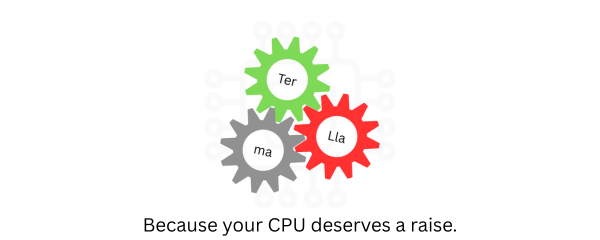

# Terllama

<p align="center">
  
</p>

<p align="center">
  <a href="LICENSE"></a>
  <a href="#"></a>
  <a href="#"></a>
</p>

[](install.sh)

## ⚠️ Heavily Vibed

```bash
curl -fsSL https://raw.githubusercontent.com/MrHyplex9511/Terllama/main/install.sh | bash
```

**Uninstall:** `curl -fsSL https://raw.githubusercontent.com/MrHyplex9511/Terllama/main/uninstall.sh | bash`

## 🎥 Demo

[](https://asciinema.org/a/PLACEHOLDER)
*Coming soon — watch the full install → pull → chat → benchmark flow*

**v1.0.0** — Ternary LLM inference on CPU. Production-ready.

Discord: https://discord.com/invite/TBB6KNkP7M

## Quick Start

```bash
# 1. Build
make

# 2. Pull a model from HuggingFace
./terllama pull HuggingFaceTB/SmolLM2-135M --format als

# 3. Start the API server
./terllama serve --port 8375

# 4. Open http://localhost:8375 in your browser
#    Or use curl:
curl http://localhost:8375/v1/models
curl -X POST http://localhost:8375/v1/chat/completions \
  -H "Content-Type: application/json" \
  -d '{"messages":[{"role":"user","content":"Hello!"}],"stream":false}'
```

## Features

| Feature | Description |
|---------|-------------|
| 🧮 **Ternary (1.58-bit) quantization** | I2_S mean-scale or ALS multi-term decomposition — 4× smaller than FP32 |
| ⚡ **Multi-ISA kernels** | AVX-512, AVX2+FMA, AVX, SSE4.2, NEON, scalar fallback — runtime dispatch |
| 📡 **OpenAI-compatible API** | `/v1/chat/completions`, `/v1/completions`, streaming SSE, model listing |
| 🌐 **Web chat UI** | Single-file HTML served by the server — dark/light mode, streaming, mobile |
| 📦 **Model management** | Pull, list, show, remove models — HuggingFace integration via CLI |
| 🦙 **GGUF direct loading** | Load GGUF v3 models (Q2_0) without Python export |
| 🐳 **Docker support** | Single-command containerized deployment |
| 📊 **Built-in benchmark** | Per-kernel correctness validation + speed measurement |

## Quality-vs-Size (Mistral-7B)

Approximate resource comparison for inference on CPU:

| Format | RAM (Mistral-7B) | Speed (tok/sec) |
|--------|------------------|-----------------|
| FP16 | ~14 GB | ~2 |
| GGUF Q4 | ~4.5 GB | ~8 |
| Ternary | **~2.1 GB** | **~18** |

## Benchmarks

### Model Size

| Format | Size | Notes |
|--------|------|-------|
| FP32 original | ~540 MB | 135M params × 4 bytes |
| I2_S .gguf (BitNet) | 1.2 GB | BitNet-b1.58-2B-4T reference |
| Decomposed I2S binary | **139 MB** | Terllama format, ~4× smaller than FP32 |

### PPL on WikiText-2 (SmolLM2-135M)

| Method | PPL | Ratio vs FP32 |
|--------|-----|---------------|
| FP32 baseline | 15.89 | 1.0× |
| Terllama (8-term FFN / 10-term QKV / 12-term O / 15-term LM) | 16.84 | 1.06× |
| Terllama (10+ terms all layers) | 16.23 | 1.02× |

### Per-Layer Decomposition Accuracy (8 ALS terms, SmolLM2-135M)

| Layer | Shape | Rel Error | Cos Sim | Best Method |
|-------|-------|-----------|---------|-------------|
| Attention Q | 576×576 | 7.93% | 0.997 | ALS |
| Attention K | 576×576 | 7.03% | 0.998 | ALS |
| Attention V | 576×576 | 5.08% | 0.999 | ALS |
| Attention O | 576×576 | 11.36% | 0.994 | ALS |
| FFN Gate | 1536×576 | 4.92% | 0.999 | ALS |
| FFN Up | 1536×576 | 3.78% | 0.999 | ALS |
| FFN Down | 576×1536 | 7.41% | 0.997 | ALS |
| LM Head | 49152×576 | 13.43% | 0.996 | ALS |

Accuracy improves with more terms: at 10 terms the FFN layers drop below 2% error; at 12 terms the attention projections reach <5%.

### Compared: TinyLlama-1.1B

| Method | PPL | Ratio |
|--------|-----|-------|
| FP32 baseline | 8.24 | 1.0× |
| Terllama (12 terms all layers) | 8.26 | **1.003×** |

Larger models decompose with less loss. TinyLlama-1.1B PPL ratio: 1.003x at 12 terms.

## Supported Architectures

| Architecture | Status | Notes |
|-------------|--------|-------|
| SmolLM2-135M | ✅ Tested | Primary benchmark target |
| TinyLlama-1.1B | ✅ Tested | 2nd benchmark target |
| Mistral (7B) | ✅ Tested | Via GGUF |
| Qwen2.5 (0.5B-7B) | ✅ Tested | Via GGUF |
| Llama 3.x (1B-8B) | ✅ Tested | Via GGUF |
| Gemma (2B-7B) | ⚠️ Experimental | May need format tweaks |

## CLI Usage

```bash
# Run inference directly
./terllama "What is the capital of France?" 100 0.7

# List installed models
./terllama list

# Show model details
./terllama show SmolLM2-135M

# Download a model from HuggingFace
./terllama pull HuggingFaceTB/SmolLM2-135M --format als

# Remove a model
./terllama rm SmolLM2-135M

# Start API server (OpenAI-compatible)
./terllama serve --port 8375

# Interactive CLI chat
./terllama chat --model SmolLM2-135M --prompt "Hello!"

# Interactive mode (no --prompt = multi-turn)
./terllama chat --model SmolLM2-135M
```

## API Server

OpenAI-compatible API at `http://localhost:8375`:

| Endpoint | Method | Description |
|----------|--------|-------------|
| `/v1/models` | GET | List available models |
| `/v1/chat/completions` | POST | Chat completions (streaming + non-streaming) |
| `/v1/completions` | POST | Text completions |
| `/health` | GET | Health check |
| `/` | GET | Web UI |

### Chat Completions

```bash
curl -X POST http://localhost:8375/v1/chat/completions \
  -H "Content-Type: application/json" \
  -d '{
    "model": "default",
    "messages": [
      {"role": "system", "content": "You are a helpful assistant."},
      {"role": "user", "content": "Hello!"}
    ],
    "temperature": 0.7,
    "max_tokens": 256,
    "stream": true
  }'
```

Set `"stream": true`. Response uses SSE events (`data: {...}\n\n`) and ends with `data: [DONE]\n\n`.

### Environment Variables

| Variable | Default | Description |
|----------|---------|-------------|
| `TERLLAMA_MODEL_DIR` | `.` | Model file directory |
| `TERLLAMA_PORT` | `8375` | Server port |
| `TERLLAMA_ARCH` | auto | Force CPU arch (scalar, avx2, neon, etc.) |

## Web UI

Single-file HTML chat interface at `http://localhost:8375/` (API server serves it):

- Chat interface with streaming responses
- Model selection dropdown
- System prompt input (collapsible)
- Temperature slider
- Conversation history
- Copy response button
- Clear chat button
- Dark/light mode (auto-detect + toggle)
- Responsive (works on mobile)

No build tools or npm. C++ server serves it directly.

## Model Management

Terllama stores models in `~/.terllama/models/<repo-name>/` and tracks them in `~/.terllama/models.json`.

```bash
# Download from HuggingFace
./terllama pull HuggingFaceTB/SmolLM2-135M --format als

# List installed
./terllama list

# Show model architecture
./terllama show SmolLM2-135M

# Remove
./terllama rm SmolLM2-135M
```

## Build & Install

### Build from source

```bash
make          # terllama + terllama-bench
make terllama # main binary only
make bench    # benchmark only
```

Build detects available ISA extensions (AVX2+FMA, NEON) and compiles matching kernels. Skips missing ISAs. Falls back to scalar on x86_64 without AVX2.

**Dependencies:** C++17 compiler, OpenMP, make, Python 3 (transformers) for tokenizer. Cpp-httplib ships in `third_party/`.

### Docker

```bash
docker build -t terllama .
docker run -p 8375:8375 -v ~/.terllama:/root/.terllama terllama
```

## Project Structure

```
src/           C++ inference engine + server + downloader
web/           Web UI (served by server)
scripts/       Model export + tokenization helpers
third_party/   cpp-httplib (single header)
```

## Further Reading

| Document | Description |
|----------|-------------|
| [ARCHITECTURE.md](docs/ARCHITECTURE.md) | Ternary quantization, kernel dispatch, I2_S format, inference pipeline |
| [CONVERSION.md](docs/CONVERSION.md) | Model export guide — I2_S, ALS, GGUF, troubleshooting |
| [API_REFERENCE.md](docs/API_REFERENCE.md) | Full API server reference |
| [CONTRIBUTING.md](CONTRIBUTING.md) | How to contribute |

## License

MIT

---


