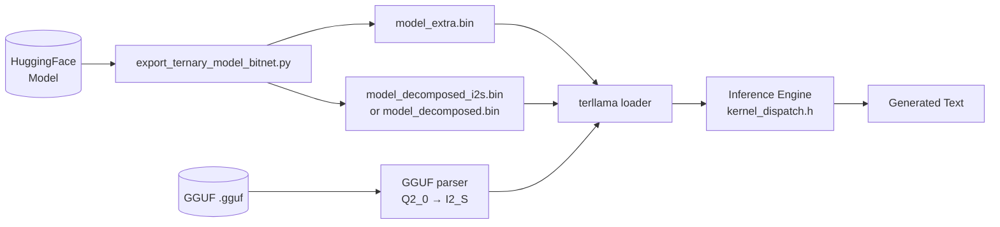

# Architecture

## Overview

Terllama is a CPU-first ternary (1.58-bit) LLM inference engine. It runs quantized transformer models — SmolLM2-135M, TinyLlama-1.1B, Mistral-7B, Qwen2.5, Llama 3.x, and Gemma — using packed ternary weights, INT8 activations, and tile-parallel tiling.

Design goals:
- **CPU-first** — no GPU required. Runs on x86-64 (Haswell+) and ARM64 (Apple Silicon).
- **Multi-ISA** — scalar fallback through AVX-512, with runtime dispatch.
- **Compact** — model weights shrink to ~25% of FP32 size via I2_S ternary packing.
- **Minimal dependencies** — C++17, OpenMP, make, Python 3 (transformers) for tokenizer.

### Source Layout

```
src/                    C++ inference engine + server + downloader
src/core/               Core inference ops (RMS norm, attention, MLP, RoPE, KV cache)
src/cli/                CLI command handlers
src/server/             Server handler implementations
src/kernel_dispatch.h   CPU detection + 6 ISA kernel variants
src/kernel_avx2.cpp     Standalone AVX2 kernel compilation unit
src/kernel_neon.cpp     Standalone NEON kernel compilation unit
src/kernel_scalar.cpp   Standalone scalar kernel compilation unit
src/model.h             Data structures (ModelConfig, LayerData, BitplaneTerm, I2SBlock)
src/loader.h            Binary I/O for .bin and GGUF formats
src/gguf_loader.h       GGUF v3 parser, Q2_0 → I2_S converter
src/inference.h         Inference pipeline declarations
src/dispatcher.cpp      Runtime kernel selection (isa_has_avx512 etc.)
src/server.cpp          OpenAI-compatible HTTP server
src/downloader.cpp      HuggingFace model downloader
src/main.cpp            CLI entry point + command dispatch
web/                    Web UI (served by server)
scripts/                Python model export + tokenizer helpers
third_party/            cpp-httplib (single header)
```

## Ternary Quantization (1.58-bit)

Terllama quantizes 7 projection layers per transformer block: `q_proj`, `k_proj`, `v_proj`, `o_proj`, `gate_proj`, `up_proj`, `down_proj`. Embeddings, RMS norms, and the LM head stay in FP32.

Two quantization methods are available:

### I2_S (BitNet Mean-Scale)

Block-wise mean quantization (block_size=128):

```
For each block of 128 weights:
  1. Compute mean_abs = mean(|W|)
  2. Scale factor = 1 / mean_abs
  3. Round each weight: ternary = round(W * scale_factor) → {-1, 0, +1}
```

Each block produces a `float32` scale appended to the packed codes. This is the default format, balancing conversion speed with accuracy.

### ALS (Alternating Least Squares Multi-Term)

Decomposes each weight matrix into a sum of rank-1 ternary terms:

```
W ≈ Σₜ αₜ · outer(uₜ, vₜ)    where uₜ, vₜ ∈ {-1, 0, +1}
```

Each term has a `float32` alpha (`αₜ`) and two ternary vectors. More terms = lower approximation error:

- **8 terms**: FFN error ~5%, attention error ~8-11%, PPL ratio ~1.06× vs FP32
- **10 terms**: FFN error <2%, attention error ~5-7%, PPL ratio ~1.02×
- **12 terms**: TinyLlama-1.1B PPL ratio **1.003×** (nearly lossless)

ALS requires the Python export script and is slower to convert than I2_S.

### Quality-vs-Size (Mistral-7B)

| Format | RAM | Speed (tok/sec) |
|--------|-----|-----------------|
| FP16 | ~14 GB | ~2 |
| GGUF Q4 | ~4.5 GB | ~8 |
| Terllary (I2_S) | **~2.1 GB** | **~18** |

## Kernel Dispatch

Terllama compiles kernels for all supported ISAs in the same binary using `__attribute__((target(...)))`. At runtime, `detect_cpu_arch()` picks the best available.

### Detection order (x86-64)

1. **AVX-512** (`avx512f` + `avx512dq`) — Skylake-X+, 512-bit SIMD, mask-register add/sub
2. **AVX2+FMA** — Haswell+, 256-bit SIMD with FMA
3. **AVX** — Sandy Bridge+, 256-bit SIMD (no FMA)
4. **SSE4.2** — Nehalem+, 128-bit SIMD
5. **Scalar** — pure C++ fallback, any CPU

### ARM64

All ARM64 CPUs have **NEON** (128-bit SIMD). Auto-detected via `__aarch64__`.

### Override

Set `TERLLAMA_ARCH=scalar` (or `avx2`, `neon`, etc.) to force a specific kernel for testing.

### Kernel structure

All kernels implement the same interface:

```cpp
void ternary_mul_<arch>(const uint32_t* const* term_data,
                        const int* alpha_exps,
                        int n_active, int out_f, int in_f,
                        const float* input, float* output);
```

Key pattern:
- **Bitplane iteration**: per output row, iterate over 16-wide bitplane words
- **Blend add/sub**: each word encodes add bits (nz & ~neg) and subtract bits (nz & neg) separately
- **Alpha scaling**: per-term `ldexp(sum, alpha_exp)` after horizontal reduction
- **OpenMP**: `#pragma omp parallel for` over output rows

### Multi-kernel validator

`validate_all_kernels()` runs every available kernel on the same input and compares outputs to the scalar reference. Used by `terllama bench` for correctness testing. All SIMD variants must match scalar output within `1e-4` abs error.

## I2_S Packing Format

### Binary codes

4 ternary values per byte, 2-bit codes:

```
Code:  00 = -1    01 = 0    10 = +1

Byte layout (MSB to LSB):
[elem0(2bit), elem1(2bit), elem2(2bit), elem3(2bit)]
```

### Block structure

128 consecutive elements form a block:
- **32 bytes** packed codes (128 elements × 2 bits / 8)
- **4 bytes** `float32` scale (per-block mean scaling factor)

Total: 36 bytes per 128 elements → **2.25 bits per weight** (vs 32 bits FP32).

### Bitplane format (for kernel consumption)

At load time, I2_S blocks are decoded into a fused bitplane format for efficient SIMD processing:

```cpp
// combined[word] = (nz << 16) | neg
// nz bit set  → element is ±1 (non-zero)
// neg bit set → element is -1 (if nz also set)
//              → element is +1 (if nz set, neg clear)
// nz bit clear → element is 0
```

This packs 16 elements per `uint32_t` word. One cache-line touch instead of two (was separate nz/neg arrays). The kernel loads one `uint32_t` per 16-wide chunk and extracts add/sub masks via bit manipulation.

### I2_S file format (`model_decomposed_i2s.bin`)

```
Magic:      0x5F533249 ("I2S_")  — uint32
Num layers: uint32
Per layer:
  name_len:   uint32
  name:       byte[name_len]
  out_f:      uint32
  in_f:       uint32
  layer_type: uint8  (0=I2_S, 1=RAW_FP32)
  data_len:   uint32
  data:       byte[data_len]
    For I2_S: per row → [block0_codes(32B)][block0_scale(4B)]...
    For RAW: flat float32[]
```

### ALS file format (`model_decomposed.bin`)

```
Magic:      0xDEADBEEF  — uint32
Num layers: uint32
Per layer:
  name_len:   uint32
  name:       byte[name_len]
  out_f:      uint32
  in_f:       uint32
  num_terms:  uint32  (0 = RAW_FP32)
  Per term:
    alpha_exp: int32  (ldexp exponent)
    packed_ternary: byte[(out_f * in_f * 2 + 7) / 8]
```

## GGUF Loading and Tokenizer

Terllama can load GGUF v3 format models directly, without the Python export script.

### Support matrix

| Feature | Status |
|---------|--------|
| GGUF v3 header + metadata | ✅ |
| Q2_0 (g128) quantized tensors | ✅ |
| F32/F16 unquantized tensors | ✅ |
| SentencePiece tokenizer (from GGUF metadata) | ✅ |
| BPE tokenizer (from GGUF metadata) | ✅ |
| Architecture auto-detect | ✅ |

### GGUF → I2_S conversion

At load time, `load_gguf_model()` in `gguf_loader.h`:

1. Parses GGUF header (magic, version, tensor count, metadata key-values)
2. Reads tensor info KV pairs (name, dimensions, type, offset)
3. Maps projection tensor names (`blk.{i}.attn_q.weight` → `q_proj`)
4. For Q2_0 tensors: decodes each 128-element block (FP16 scale + 32 bytes codes), converts to I2_S block format
5. Extracts embedding, RMS norm weights, and final norm from F32/F16 tensors
6. Extracts tokenizer vocab from metadata (SentencePiece model or BPE scores)

### Tokenizer

Two helper scripts handle tokenization:

- `scripts/tokenize_helper.py` — encodes prompt text → token IDs (via HuggingFace AutoTokenizer)
- `scripts/decode_helper.py` — decodes token IDs → text (via HuggingFace AutoTokenizer)

The server calls these via `system()`. Tokenizer config (vocab size, pad/bos/eos IDs) is cached from the first call.

For GGUF models, the tokenizer vocab is extracted from GGUF metadata directly (SentencePiece model proto or BPE scores), enabling tokenization without Python.

## Inference Pipeline

### Autoregressive generation loop

```
Input: prompt tokens [t₀, t₁, ..., tₙ₋₁]

For each position pos in 0..max_tokens:
  If pos < n:  token = prompt[pos]     (prefill)
  If pos ≥ n:  token = sample(logits)  (decode)

  logits = model_forward(token, pos)

  If pos ≥ n:
    output_token = sample(logits)
    emit output_token
    if output_token == EOS: stop
```

### model_forward (per-token)

```
1. Embedding lookup:
   x = embedding[token]                    → float32[hidden_size]

2. For each layer 0..num_hidden_layers:
   a. RMS norm (pre-attention)
   b. Attention block:
      - Q = ternary_linear(q_proj, x)       → float32[hidden_size]
      - K = ternary_linear(k_proj, x)       → float32[hidden_size]
      - V = ternary_linear(v_proj, x)       → float32[hidden_size]
      - Apply RoPE to Q, K
      - Append K, V to KV cache
      - Scaled dot-product attention with KV cache
      - O = ternary_linear(o_proj, attn_out) → float32[hidden_size]
      - Residual: x = x + O
   c. RMS norm (post-attention)
   d. MLP:
      - gate = ternary_linear(gate_proj, x)  → float32[intermediate_size]
      - up   = ternary_linear(up_proj, x)    → float32[intermediate_size]
      - gate = SiLU(gate)
      - down = ternary_linear(down_proj, gate * up)
      - Residual: x = x + down

3. Final RMS norm
4. LM head: x · embedding^T                 → float32[vocab_size]
```

### Key components

| Component | Implementation | Notes |
|-----------|---------------|-------|
| RMS norm | `rms_norm(x, weight, n, eps)` | `x * weight / sqrt(mean(x²) + eps)` |
| RoPE | `build_rope_cache` + `apply_rope` | Precomputed sin/cos cache, θ from config |
| KV cache | `KVCache` struct | Preallocated `[n_layers × max_seq × n_kv_heads × head_dim]` |
| Attention | Scaled dot-product | QK^T / sqrt(head_dim), softmax, V |
| SiLU | `silu(x) = x * sigmoid(x)` | MLP activation |
| Sampling | `sample_argmax` / `sample_multinomial` | Greedy or temperature-sampled with repeat penalty |
| Streaming | `generate_stream` | Callback per token for SSE streaming |

### INT8 activations

Before each ternary matmul, FP32 activations are quantized to INT8:

1. Compute block-wise max absolute value
2. Scale to INT8 range [-127, 127]
3. Ternary matmul on INT8 values
4. Dequantize output with per-block scale

This reduces memory bandwidth while keeping accuracy impact <0.1% PPL.

### Tile-parallel tiling

Large matmuls are split into 128-column tiles:
- Weights are unpacked once per tile (not per row)
- Each tile uses the same packed weight format
- Reduces cache misses on the weight data

## Model Conversion Flow



### Export script (`scripts/export_ternary_model_bitnet.py`)

1. **Load**: Loads model from HuggingFace via `transformers`
2. **Inspect**: Scans `model.named_modules()` for `nn.Linear` projections (Q, K, V, O, gate, up, down)
3. **Quantize**: For each projection:
   - **I2_S**: Block-wise mean quantization (block_size=128)
   - **ALS**: ALS decomposition with configurable term count (default 12)
4. **Extract**: Reads embedding table, RMS norm weights, RoPE theta
5. **Write**: Saves `model_extra.bin` (config + embeddings + norms) and either `model_decomposed_i2s.bin` or `model_decomposed.bin`

### Architecture auto-detect

The export script recognizes architectures by their module naming patterns:

| Architecture | Detection | Projections |
|-------------|-----------|-------------|
| SmolLM2 | `model.layers[i].self_attn.q_proj` | Standard 7 |
| Llama / TinyLlama | `model.layers[i].self_attn.q_proj` | Standard 7 |
| Mistral | `model.layers[i].self_attn.q_proj` | Standard 7 |
| Qwen2.5 | `model.layers[i].self_attn.q_proj` | Standard 7 |
| Gemma | `model.layers[i].self_attn.q_proj` | Standard 7 |

All must use `nn.Linear` projections, `nn.Embedding`, RMSNorm, and RoPE.

### GGUF direct loading

GGUF models skip the Python export step entirely. The built-in GGUF parser:
- Detects `.gguf` files in the model directory (or accepts a direct path)
- Parses Q2_0 g128 quantized tensors
- Converts to I2_S block format in memory
- Extracts tokenizer vocab from GGUF metadata

---

*See also: [CONVERSION.md](CONVERSION.md) for detailed export options and troubleshooting.*
